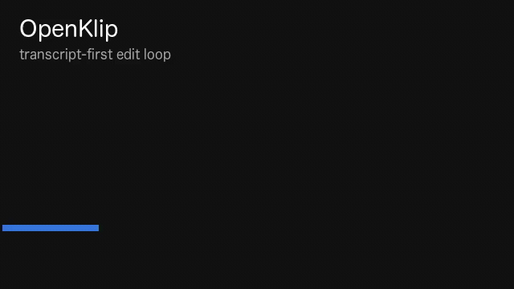

# OpenKlip

**Agent-native video toolchain**



OpenKlip is a local-first toolchain for programmatic video editing. An external agent (Cursor, Claude Code, Codex, your scripts) runs the edit loop through CLI commands; the browser is where you review, adjust, and export. Every project is plain files on disk: `project.json` is the contract between agent and editor. No bundled LLM, no database, no cloud.

Today the edit model is transcript-driven (words, cuts, overlays on a timeline spine). The category is the product; the transcript is the current representation, not the ceiling.

---

## Philosophy

Most video tools assume a human at the timeline and bolt on "AI features." OpenKlip assumes an **agent at the terminal** and a human at the browser: both on the same folder.

- **Agents** read state, mutate the edit, verify, export: via named CLI actions and `openklip actions --json`.
- **Humans** preview the result, refine cuts and overlays in the UI, drop assets into `assets/`.

The GUI is not a walled garden. It is a peer surface on the same `project.json` the CLI writes.

---

## Principles

These follow from how the repo is actually built:

**Local-first.** Projects live under `projects/<slug>/` as plain files. Ingest transcribes with Transformers.js (Whisper). Export and proxies use bundled `ffmpeg-static` / `ffprobe-static`.

**One edit, one file.** `project.json` holds the edit: words, cuts, asset registry, overlays, captions, look flags. `brief.md` is adjacent project context. Paths under `working/` and `output/` are derived (proxy, transcript, ffmpeg asset proxies, `chats.json`, `actions.jsonl`, `tasks.json`, exports).

**Same file, two surfaces.** The CLI applies edits through `runAction()` in `src/registry.ts`. The GUI applies edits through Next.js server actions in `app/actions.ts` (via `mutateProject()` for serialized read-modify-write). Both persist to the same `project.json`. Reload the browser after external CLI edits.

**Agent-native, not agent-bundled.** No in-app LLM for the core loop. With Claude selected, chat loads the openklip MCP server and applies edits directly (cut, zoom, b-roll, title, export). Other agents get live CLI answers or skill-router hints. "Find filler" and "Describe assets" shell out to the selected agent CLI (`src/agent-driver.ts`). Or run `bun run agent-demo`.

**Sample-accurate time.** Word and overlay times are stored as integer samples at 48 kHz. CLI commands take seconds for human-facing spans and convert internally.

**User drop zone.** Original assets land in `assets/` (upload, drag-drop, or copy into the folder). Generated proxies land in `working/assets/`. Folder sync (`POST /api/projects/:slug/assets/sync`, plus page load) registers new drops and prunes stale registrations whose `src` is not a file under `assets/` (serialized per-slug so overlapping polls/tabs do not race `project.json`).

---

## Project layout

The user picks the projects folder in the GUI. Resolution order:

1. `OPENKLIP_PROJECTS_ROOT` environment variable
2. `.openklip/projects-root` (one line, absolute path; set by the GUI folder picker)
3. `~/Movies/OpenKlip` (fallback for the CLI and pre-pick cases)

```text
projects/<slug>/
  project.json       ← edit (EDL)
  brief.md           ← optional project brief
  assets/            ← user originals (flat)
  working/           ← generated cache
  output/out.mp4     ← export
```

| Path | In code |
| --- | --- |
| `project.json` | Loaded by `loadProject()` / saved by GUI and CLI |
| `assets/` | `projectPaths(slug).assets`: `registerAsset`, folder scanner |
| `working/proxy.mp4` | Preview proxy from ingest |
| `working/transcript.json` | Whisper output |
| `working/assets/` | ffmpeg proxies for video/audio assets |
| `working/chats.json` | Agent sidebar threads (`src/chats.ts`, `/api/projects/[slug]/chats`) |
| `working/actions.jsonl` | Append-only action history |
| `working/tasks.json` | Agent task progress records |
| `working/history/` | Revert snapshots, newest 100 revisions |
| `output/out.mp4` | `openklip export` / export API |

Agent sidebar chats use `working/chats.json`, not `localStorage` (color scheme and default-agent preferences still use `localStorage` in the browser).

---

## What works today

Verified against the current codebase (`VERSION` / `package.json` `0.38.0.0`, 1661 tests):

- **Ingest**: video → local transcript + preview proxy + `project.json` (`openklip ingest`; refuses re-ingest unless `--force`)
- **Transcript editing**: click words to toggle `deleted`; `openklip cut` / `cut --text` / `restore` on CLI
- **Phrase search + batch cuts**: transcript search bar (Mod+F to focus, Enter next match, Escape clear) with exact and punctuation-insensitive matching, Kept/Cut scopes, click-to-seek, select-as-span, Cut first / Cut all and Restore / Restore all with affected-word counts and an optional note; same phrase engine as the CLI
- **Bounded transcript reads**: `openklip transcript grep`, `span`, `phrase` for agent discovery without dumping full transcripts
- **Preview**: all-intra proxy; scheduler plays kept ranges only; compact center column (`max-w-2xl`)
- **Editor layout**: Resizable right chat sidebar (340–760px, persisted); center column is preview with Properties/Settings below video; transcript toggle; timeline in a bottom drawer
- **Agent chat**: `/` skills menu, inline skill tokens; skills route to the same tool surface as `openklip tools` on `project.json`; the tool-calling edit prompt also advertises a skill index (id + description, capped at 20) the model can load in full with the read-only `load_skill` tool; Claude applies edits via MCP; other agents answer or suggest commands
- **Asset cards**: `openklip analyze` or **Describe assets** in the asset bin runs per-asset subagents that write summary/tags/bestFor onto each b-roll/still so agents place media by meaning
- **Cinema player**: fullscreen overlay with Linear-parity transport bar (`web/components/cinema-player.tsx`, `player-controls.tsx`)
- **Preview cut transitions**: a decorative `glimm` WebGL sweep plays at each auto-advance cut boundary, matching `project.look.transition` (crossfade or dip); respects `prefers-reduced-motion`, degrades gracefully without WebGL, and now plays in the fullscreen cinema player too (`CinemaPlayer` gained its own `CutScheduler`, fixing a bug where it previously played every cut uncut); see [TODO.md](./TODO.md#known-limitations) for the visual-parity caveat versus the export side's ffmpeg transition
- **Captions**: preview overlay + ASS burn-in on export; five style presets (`boxed`, `clean`, `karaoke`, `bold-caps`, `minimal`) defined once and rendered identically by both (`openklip captions-style <slug> <style>`, Config panel picker); unknown/missing style ids fall back to `boxed` on load
- **Assets**: register b-roll, music, stills; sidebar asset bin with upload + `assets/` folder sync; upload from chat `+`
- **Overlays**: b-roll cover, Ken Burns stills, push-in zooms, title cards (lower / center / hero), vignette; phrase helpers (`*-add-phrase`) on CLI
- **Export**: ffmpeg composes kept ranges + overlays + captions; GUI export dialog picks max height (720p / 1080p / 4K), compression preset (studio / social / web / web-low), output frame rate (source / 24 / 25 / 30 / 48 / 60), output format (MP4 / GIF, GIF has no audio and is capped at 960px width / 15fps / 5 minutes kept duration), destination (file / clipboard, clipboard copies the exported path as text), and platform preset with a live size/time estimate; height, compression, frame rate, format, and platform settings match on CLI (`--height`, `--fps`, `--compression`, `--format`, `--platform`), MCP, and the export API. The GIF width cap can be overridden per export up to a 1920px hard ceiling via CLI `--gif-max-width`, the MCP `export` tool, the export route, the export server action, and (as of v0.33.0.1) a GUI numeric input next to the GIF format hint. Destination stays GUI-only, since Clipboard is a client-side browser API call with no CLI/MCP equivalent
- **Export platform presets**: Platform picker (GUI) and `--platform <id>` (CLI/MCP): `youtube`, `youtube-4k`, `x`, `linkedin`, and **`shorts`** (9:16 vertical, 30fps, 1920 height cap, -14 LUFS). Any control changed after picking a platform still wins; `--loudness <lufs>` overrides loudness for one export only
- **Vertical reframe (Shorts)**: `project.export` stores aspect (`source`, `16:9`, `9:16`, `1:1`) and crop (focus X/Y, zoom 1-3) shared by preview and ffmpeg export; GUI Reframe controls, orientation toggle (16:9 / 9:16 / 1:1), Manual / Scene / Vision crop modes, Fill / Split vertical layout, safe-area preview guides (TikTok, Reels, YouTube Shorts, generic); `openklip export-set`, `openklip vision-focus` (macOS), `bun run agent-make-short`
- **Vision reframe sidecar** (macOS): `tools/vision-focus.swift` detects face center, falls back to attention saliency, attaches on-frame OCR text; GUI **Vision focus** button in Reframe; enriches speaker `sceneLog` segments with `focusX`/`focusY`
- **LLM highlight detection**: `openklip highlights-detect <slug>` finds short-form clip candidates; `openklip export-highlight <slug> all` renders each to `output/highlights/{id}.mp4`; GUI **Highlights** panel (detect, list, seek)
- **Music placement**: place a registered music asset under the edit with gain, fades, source in-point, and trim/loop mode (`openklip music-add` / `music-set` / `music-rm`); Config panel Music section, placed-music timeline track, preview bed with a mute toggle, mixed into the export by ffmpeg
- **Cleanup review**: deterministic filler-word detection (isolated disfluencies auto-safe; ambiguous words and phrases flagged review) plus dead-air detection from real audio analysis, with per-candidate risk and an "apply all safe" batch action; Cleanup section in the Config panel, `openklip cleanup <slug> [--json] [--apply-safe]`, MCP `cleanup_report`
- **VAD snap + seam crossfades**: cut boundaries optionally snap onto detected silence (`cuts.snap`) and export joins the resulting seams with equal-power crossfades that reuse a few ms of removed audio to avoid clicks; wired through the exporter, preview scheduler, and every CLI/MCP range/status query so they all agree; Config panel Audio section, GUI/MCP `cuts-snap` action
- **Ducking, loudness, voice highpass, and de-essing**: export-only audio quality pass sidechain-ducks the music bed under speech, applies single-pass loudness normalization toward a target LUFS, can highpass the voice track, and can de-ess it (ffmpeg's `deesser` filter, intensity 0-1); `openklip audio <slug>` and the Config panel Audio section (preview audio stays unprocessed)
- **Rich graphics templates**: HTML/CSS graphic templates (`kind: "rich"`) render through headless Chrome (`chrome-headless-shell` via `puppeteer-core`), driven by the same `web/lib/graphic-runtime.ts` as the live preview, so export matches preview frame-for-frame. Frames capture with a transparent background to a ProRes 4444 alpha MOV (`src/headless-render.ts`), then composite as a timed ffmpeg overlay. Chrome is an optional, one-time download (`bunx puppeteer browsers install chrome-headless-shell`); the default text path needs no browser
- **Graphic keyframe animation**: graphic overlays carry an optional declarative `keyframes` array (opacity, scale, x/y position; seven easings — `linear`, `easeIn`, `easeOut`, `easeInOut`, `spring`, `backOut`, `anticipate`) evaluated frame-pure by the shared graphic runtime, so preview and export render identically. Edit via timeline diamond markers and a Keyframes inspector section, `graphic-set` (with `--keyframes-file`/`--clear-keyframes` on the CLI), or MCP; undo/history cover keyframe edits automatically
- **Fullscreen overlays**: the cinema player renders the graphics/titles/captions overlay stack (`web/components/preview-overlays.tsx`), shared with the inline preview and synced to playback
- **Product announcement graphics**: a catalog-constrained `product-announcement` json-render graphic type; agents author a validated JSON spec via `openklip json-graphic-add` / `json-graphic-set` (CLI / GUI / MCP), the editor previews the exact same React render, and it exports through the normal timeline. Specs are hard-validated (accent values, spec size, graph cycles, orphaned elements, non-scene roots, missing catalog/spec fields) before preview or export; invalid graphics degrade gracefully instead of bricking the render
- **Config shell + responsive panels**: right-side Config panel with a color temperature pad plus captions/timing controls; Chat and Config stay reachable below the desktop sidebar breakpoint via overlay buttons
- **Written rationale**: `--note "<why>"` on any `cut` or overlay records why a pick was made; metadata only, never reaches ffmpeg, surfaces in `overlays` / transcript / MCP (`--note ""` clears it)
- **Phrase-anchored cues**: phrase-placed overlays remember the spoken phrase and re-resolve onto the current kept words after a re-cut (`openklip reanchor`); a deleted phrase flags `stale` and keeps the last good span
- **Multi-take assembly**: `openklip take-add` / `takes` / `assemble` splice the best take per line into one single-source `project.json` the cut/overlay/export engine edits unchanged; a Takes section in the Config panel (between Highlights and Music) browses ingested takes and assembles a selection directly in the browser, and now also uploads a new take from the browser (file-picker "Add take" control, no drag-drop)
- **Action history**: append-only per-project log (`working/actions.jsonl`) records every user-facing mutation (registry actions, asset add/remove, template/brand, multi-take assemble, brief saves) with actor (human / agent / cli / mcp / system), input/result summaries, timestamp, and revision before/after; History section in the Config panel with actor/action/task filter controls; `GET /api/projects/<slug>/history`; agents can read it directly with `openklip history <slug> [--limit] [--task] [--action] [--actor]` or MCP `history_list`
- **Revert (undo)**: every logged mutation keeps a pre-mutation snapshot in `working/history/` (newest 100 revisions); `openklip revert <slug> (--to <rev> | --task <id> | --last) [--force]`, the MCP `revert` tool, and per-entry/per-task "Revert" buttons in the History panel restore `project.json` to an earlier state as a normal, itself-revertible mutation. Restores `project.json` only, not `brief.md`, chats, tasks, asset files, or derived media; see [TODO.md](./TODO.md#known-limitations) for the details
- **Project brief**: `brief.md` at the project root holds audience, goal, tone, must-use assets, avoid list, target length, and export formats; agents read it on every chat/edit prompt (2000-char bounded); GUI Brief section in the Config panel; `openklip brief <slug> [--set <text...> | --file <path>]` and MCP `brief_get` / `brief_set`
- **Agent tasks with live progress**: every tool-calling chat edit gets a visible task (`working/tasks.json`); the chat panel's task progress card polls every 2 seconds while running and shows each step plus a cancel button that kills the underlying agent process; the agent signals completion explicitly (`task_step` / `task_complete` MCP tools) instead of relying on heuristics; agents can list past tasks with `openklip tasks <slug> [--limit] [--status] [--actor]` or MCP `task_list`
- **Make-a-draft, make-short, make-highlights, and revise-draft playbooks**: `templates/make-draft/skill.md` turns one prompt into a full first draft (respects asset must-use/avoid flags); `templates/make-short/skill.md` and `bun run agent-make-short` derive a vertical short; `templates/make-highlights/skill.md` finds clip candidates and trims each to a short; `templates/revise-draft/skill.md` applies targeted revisions or whole-task revert
- **Browser project creation**: upload a video in the New Project dialog or drop one onto the empty workspace; format-validated on client and server, source persisted into the project folder, explicit overwrite confirm on name collisions, ingest progress overlay, editor opens on completion
- **Workspace**: macOS folder picker on empty landing; inline project create; projects root persisted in `.openklip/projects-root`
- **CLI**: full edit surface; `openklip actions --json` mutations manifest; `openklip tools --json` full agent tool list
- **MCP server**: `openklip mcp` (stdio) exposes 76 tools across query, mutation, task progress, revert, and export surfaces; `.cursor/mcp.json` wired for Cursor
- **Edit templates**: `templates/<id>/skill.md` playbooks; `openklip template set`; brand presets at ingest (`openklip brand`)
- **Agent selector**: drive filler cuts via Claude Code, Codex, Cursor, or Grok subscription CLIs
- **Design system**: default shadcn/ui tokens with Base UI primitives (`app/globals.css`, `components.json`); light/dark via `.dark` class; icons via `web/lib/icon.tsx`
- **Agent demo**: `bun run agent-demo` (phrase list → cut → status → optional export)
- **Make short**: `bun run agent-make-short` (Vision enrich on macOS, 9:16 scene reframe, shorts export, verify)

Phrase-based cutting works on both surfaces: the transcript UI has search with batch cut and restore, and the CLI has `openklip cut --text`. First project on a machine: upload or drop a video in the browser, or use `openklip ingest` from the CLI. Known gaps: **[TODO.md](./TODO.md)**.

### Shorts workflow (v0.21-0.25)

End-to-end path from a long talking-head edit to a vertical short:

1. **Ingest + analyze** (optional): `openklip analyze <slug>` writes asset cards and a `sceneLog` of on-screen spans.
2. **Find hooks** (optional): `openklip highlights-detect <slug>` stores LLM clip candidates on `project.highlights`.
3. **Trim** (when needed): cut tangents/filler to target length; `make-short` warns above `--max-sec` but does not auto-cut.
4. **Reframe**: `openklip vision-focus <slug>` on macOS (or GUI Vision focus button), then `export-set --aspect 9:16 --crop-mode scene`.
5. **Export**: `openklip export-highlight <slug> h1` or `all` (writes `output/highlights/h1.mp4`, …) or `bun run agent-make-highlights <slug>`
6. **Verify**: `openklip verify <slug>`.

See `templates/make-short/skill.md` (one short from an existing edit) and `templates/make-highlights/skill.md` (multiple clips from a long source).

---

## Quick start

**Requirements:** Bun 1.3.14+, Node 24+ (`package.json` `engines`).

```bash
bun install
bun run ingest /path/to/video.mp4   # creates projects/<slug>/
bun run serve <slug>                   # opens editor (sets OPENKLIP_SLUG)
bun run export <slug>
```

Dev server (port 4399):

```bash
bun run dev                            # latest project, or ?slug= in URL
OPENKLIP_SLUG=<slug> bun run dev       # pin project when using serve-style env
```

---

## Agent loop

Typical external-agent sequence (no LLM inside OpenKlip):

```text
openklip status <slug> --json
openklip transcript grep <slug> "phrase"
openklip cut <slug> --text "phrase to remove"
openklip music-add <slug> <assetId> 0 20 --gain 0.3
openklip export <slug> --compression web --fps 30
openklip export <slug> --platform youtube-4k --loudness -13
```

In Cursor, enable the bundled MCP server (`.cursor/mcp.json`) and call the same tools without shelling out. Tool manifest: `openklip tools --json --surface mcp`.

Deterministic script:

```bash
bun run agent-demo <slug> --phrases scripts/example-phrases.txt --export
```

Command reference: **[AGENTS.md](./AGENTS.md)**. Mutation manifest: `openklip actions --json`.

---

## How it works

- **Cut spine**: `deleted` words → kept source-time ranges (`compileTimeline`, preview scheduler, exporter).
- **Preview**: `<video>` on `working/proxy.mp4`; seeks across kept ranges.
- **Export**: ffmpeg `filter_complex`: range concat, b-roll/still cover, zoompan, vignette, libass captions/titles, music mix; compression presets pick the encoder args and the output can retime to a chosen frame rate.
- **Export source**: prefers original media; can fall back to project proxies when source files are missing (see exporter).
- **Rich graphics**: `kind: "rich"` templates render to a transparent ProRes 4444 MOV via headless Chrome (`src/headless-render.ts`, lazy-loaded), then ffmpeg overlays it like a still. ffmpeg stays the master compositor; the text/ASS path stays browser-free.

---

## Development

```bash
bun run check
bun run typecheck
bun test
bun run build
```

GitHub Actions (`.github/workflows/ci.yml`): `check`, `typecheck`, `test`, `build` on push/PR to `main`.

Roadmap, known gaps, and post-MVP ideas: **[TODO.md](./TODO.md)**.

---

## License

MIT
